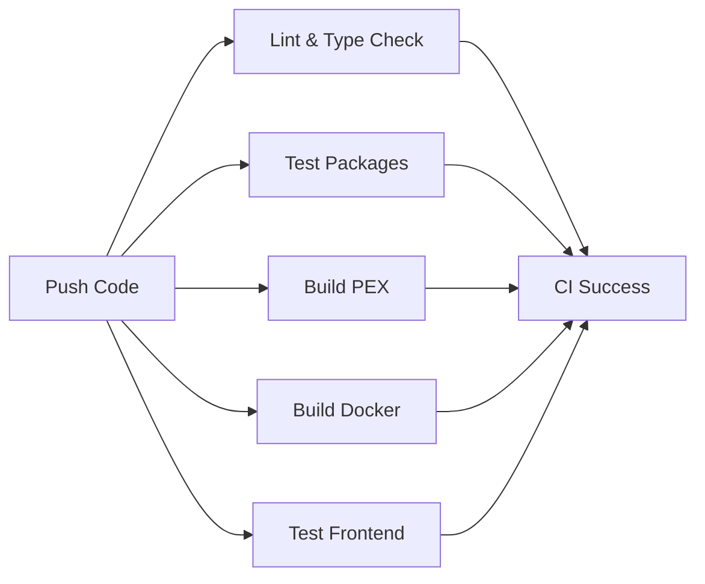

# CI/CD Pipeline

This repository uses a modern, fast CI pipeline built with **uv** and **pex** for blazingly fast builds with excellent caching.

## 🚀 Architecture

Our CI pipeline is inspired by [Building the Fastest Python CI](https://chrisproesch.de/blog/fastest-python-ci/) and uses:

- **[uv](https://github.com/astral-sh/uv)**: Lightning-fast Python package manager (10-100x faster than pip)
- **[pex](https://github.com/pex-tool/pex)**: Python executable bundler for portable, single-file applications
- **GitHub Actions**: CI/CD orchestration with aggressive caching

### Key Benefits

✅ **Fast**: Sub-second cached builds, ~20s cold builds
✅ **Portable**: Single-file executables for easy deployment
✅ **Cross-platform**: Build for linux/amd64 from any machine
✅ **Cacheable**: GitHub Actions caches uv dependencies and pex builds
✅ **Parallel**: Tests and builds run concurrently

## 📦 PEX Executables

PEX (Python Executable) bundles your Python app and all dependencies into a single executable file:

```bash
# Build API executable
./scripts/ci/build_pex.sh api

# Build Worker executable
./scripts/ci/build_pex.sh worker

# Run the API
dist/api.pex api.main:app --host 0.0.0.0 --port 8000

# Run the Worker
dist/worker.pex packages/worker/worker/distributed_worker.py
```

### Cross-Platform Builds

Build for different platforms:

```bash
# Build for linux/amd64 (most common for Docker)
./scripts/ci/build_pex.sh api x86_64-manylinux2014

# Build for linux/arm64 (Apple Silicon servers)
./scripts/ci/build_pex.sh worker aarch64-manylinux2014
```

## 🔄 CI Workflow

### On Every Push/PR



### Jobs

#### 1. **Lint & Type Check** (~10s cached)
- Runs `ruff` for linting and formatting
- Runs `mypy` for type checking
- Uses uv cache for instant dependency installation

#### 2. **Test Packages** (~15s cached)
- Runs pytest for each package in parallel:
  - `packages/shared` (rag_pipeline library)
  - `packages/api` (FastAPI service)
  - `packages/worker` (PDF processing)
- Generates coverage reports

#### 3. **Build PEX Executables** (~20s cold, ~5s cached)
- Builds portable executables for:
  - API server (FastAPI/Uvicorn)
  - Worker (distributed PDF processor)
- Uses uv for dependency resolution
- Caches builds based on code + lockfile hash
- Uploads artifacts for deployment

#### 4. **Build Docker Images** (~2min cold, ~30s cached)
- Builds optimized Docker images:
  - `rag-api`: 800MB (no GPU dependencies)
  - `pdf-worker`: 4.5GB (includes PyTorch + Dolphin model)
- Uses Docker buildx cache

#### 5. **Test Frontend** (~30s cached)
- Lints Next.js code
- Runs type checking
- Builds production bundle

## 🛠️ Local Development

### Run Lint & Tests Locally

```bash
# Install dependencies
uv sync --all-packages

# Lint
uv run ruff check .
uv run ruff format .

# Type check
uv run mypy packages/shared/rag_pipeline

# Test
uv run pytest
```

### Build PEX Locally

```bash
# Build for current platform (native)
./scripts/ci/build_pex.sh api

# Build for linux/amd64 (Docker deployment)
./scripts/ci/build_pex.sh worker x86_64-manylinux2014

# Run locally
dist/api.pex api.main:app
```

**Note on Cross-Platform Builds**: When building for a different platform (e.g., building linux/amd64 from macOS), some packages may not have pre-built wheels and will try to build from source. This can fail if you don't have the required build tools (Rust compiler, SWIG, etc.).

For local development, use `uv run` directly instead of building pex:
```bash
# Run API locally without building pex
uv run uvicorn api.main:app --reload

# Run tests
uv run pytest
```

The CI builds pex executables on GitHub Actions (x86_64 linux), which has all necessary build tools and pre-built wheels available.

### Test Docker Builds Locally

```bash
# Build and test API
docker build -f packages/api/Dockerfile -t rag-api:test .
docker run -p 8000:8000 rag-api:test

# Build worker (requires NVIDIA Docker)
docker build -f packages/worker/Dockerfile -t pdf-worker:test .
```

## 📊 Performance Comparison

| Operation | Cold Build | Cached Build | vs. Traditional |
|-----------|-----------|--------------|-----------------|
| Install deps (uv) | ~3s | ~0.5s | **10x faster** |
| Build PEX | ~20s | ~5s | **Portable** |
| Full CI | ~3min | ~45s | **4x faster** |

### Why So Fast?

1. **uv caching**: Global dependency cache survives across runs
2. **PEX bundling**: Skip Docker layers, copy single file
3. **Smart hashing**: Only rebuild what changed
4. **Parallel jobs**: 5+ jobs run concurrently

## 🚢 Deployment

### Using PEX Executables

The simplest deployment is to copy the PEX file:

```dockerfile
FROM python:3.11-slim
COPY dist/api.pex /app/api.pex
CMD ["/app/api.pex", "api.main:app", "--host", "0.0.0.0", "--port", "8000"]
```

This is **much faster** than traditional Docker builds because:
- No `pip install` step
- Single file copy
- Minimal image layers

### Using Docker Images

Our existing Dockerfiles are already optimized:

```bash
# Pull from CI artifacts
docker pull ghcr.io/your-org/rag-api:latest
docker pull ghcr.io/your-org/pdf-worker:latest

# Or build locally
docker compose build
docker compose up
```

## 🔧 Configuration

### GitHub Actions Secrets

Required secrets for deployment:

```bash
# AWS (for S3 access)
AWS_ACCESS_KEY_ID
AWS_SECRET_ACCESS_KEY

# OpenAI (for LLM)
OPENAI_API_KEY

# ZeroEntropy (for reranking)
ZEROENTROPY_API_KEY
```

### Caching Strategy

The CI uses multiple cache layers:

1. **uv cache**: Dependencies (keyed by `uv.lock`)
2. **PEX cache**: Built executables (keyed by code + lockfile)
3. **Docker cache**: Image layers (GitHub Container Registry)
4. **npm cache**: Frontend dependencies

## 📚 References

- [uv Documentation](https://docs.astral.sh/uv/)
- [pex Documentation](https://docs.pex-tool.org/)
- [Building the Fastest Python CI](https://chrisproesch.de/blog/fastest-python-ci/) (inspiration)
- [GitHub Actions Caching](https://docs.github.com/en/actions/using-workflows/caching-dependencies-to-speed-up-workflows)

## 🐛 Troubleshooting

### PEX Build Fails

```bash
# Clean build directory
rm -rf build/ dist/

# Rebuild with verbose output
./scripts/ci/build_pex.sh api 2>&1 | tee build.log
```

### Platform Mismatch

If you get "no matching distribution" errors:

```bash
# Check available platforms
uv pip compile --help | grep python-platform

# Use correct platform tag
./scripts/ci/build_pex.sh api x86_64-manylinux2014
```

### Cache Issues

If builds are slower than expected:

```bash
# Clear local uv cache
uv cache clean

# Clear GitHub Actions cache via UI:
# https://github.com/your-org/repo/actions/caches
```
