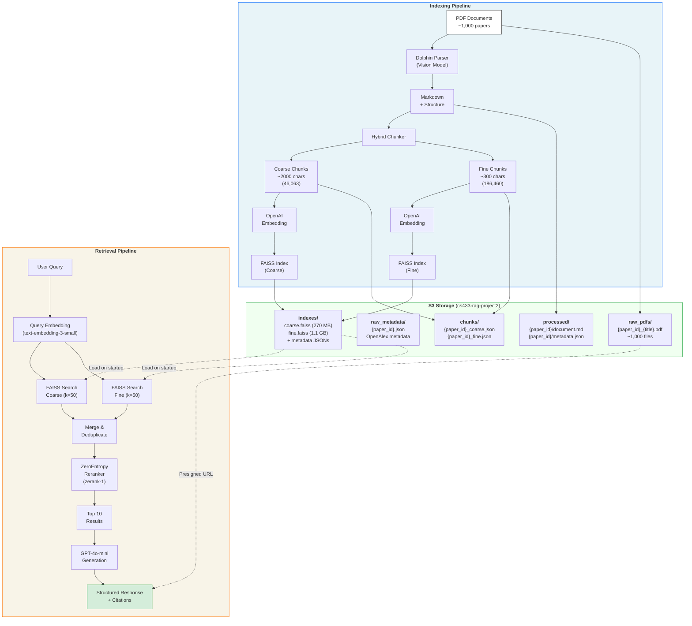
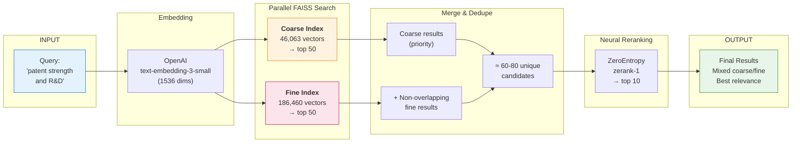
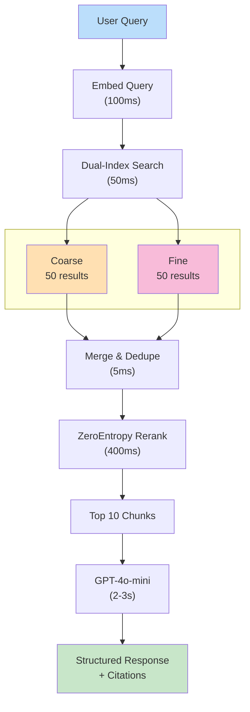
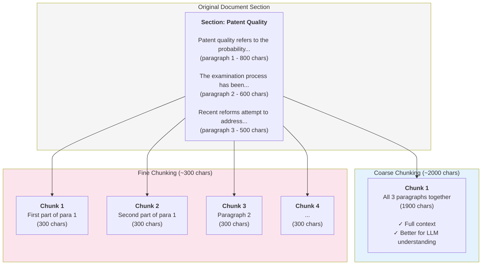

# Report Diagrams (Mermaid)

## 1. System Architecture Diagram

---

## 3. Dual-Index Retrieval Flow

---

## Alternative: Vertical Retrieval Flow

---

## Chunking Strategy Visualization

---

## How to Use

### Option 1: Mermaid Live Editor
1. Go to https://mermaid.live
2. Paste the code
3. Export as SVG/PNG

### Option 2: VS Code
1. Install "Markdown Preview Mermaid Support" extension
2. Open this file and preview

### Option 3: GitHub
- GitHub renders Mermaid in markdown automatically

### Option 4: Export for Report
1. Use Mermaid CLI: `npx @mermaid-js/mermaid-cli mmdc -i diagrams.md -o output.png`
2. Or screenshot from mermaid.live

